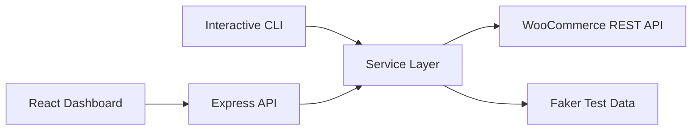

<div align="center">

# WooCommerce Actions

### A full-stack WooCommerce automation toolkit with an interactive CLI, Express API, and modern React dashboard.

Built to help developers and QA teams generate test data, create orders, manage products, duplicate catalog items, and inspect WooCommerce API responses faster.


</div>

---

## Overview

**WooCommerce Actions** is a practical automation project that connects directly to the WooCommerce REST API and exposes the workflows through three interfaces:

- **Interactive CLI** for terminal-based product and order automation.
- **Express backend API** for reusable service endpoints.
- **React dashboard** for a clean visual control panel with activity logs and result views.

The project is useful for staging stores, QA testing, demo data generation, load simulation, and developer workflows where repeatedly creating WooCommerce products or orders manually would be slow.

---

## What This Project Demonstrates

- Full-stack JavaScript application architecture.
- REST API integration with WooCommerce authentication.
- CLI automation using interactive prompts, loading states, and terminal styling.
- React state management for dashboard workflows and activity tracking.
- Backend service-layer separation for product and order operations.
- Dynamic fake data generation using Faker.
- Practical tooling for QA, testing, and e-commerce operations.

---

## Key Features

### Orders

- Create single or bulk WooCommerce orders.
- Generate dynamic billing and shipping customer data.
- Attach products by product ID and quantity.
- Update selected order fields from the dashboard.
- Support common WooCommerce order statuses such as `pending`, `processing`, `completed`, `cancelled`, and more.
- Update order metadata such as currency, customer details, payment fields, billing fields, and shipping fields.

### Products

- Create bulk **simple products** with price, stock, SKU, dimensions, weight, and generated descriptions.
- Create **variable products** with predefined variation attributes such as color and size.
- Create product variations after variable product creation.
- Retrieve a single product by ID.
- Fetch all products using paginated WooCommerce API calls.
- Duplicate an existing product multiple times.
- View product summaries and raw JSON responses in the dashboard.

### Web Dashboard

- Dark themed React dashboard.
- Sidebar navigation for dashboard, orders, and products.
- Quick action cards for common workflows.
- Activity panel showing recent actions.
- Loading spinners during API requests.
- Paginated product list view in the UI.
- Structured result cards for created, fetched, and duplicated products.
- Searchable currency selector for order updates.

### CLI

- Interactive terminal menu.
- Product creation flow for simple and variable products.
- Bulk order creation flow.
- Product retrieval, duplication, and fetch-all actions.
- Styled terminal output using Chalk, Figlet, and Ora.

---

## Tech Stack

| Layer | Technologies |
| --- | --- |
| CLI | Node.js, Inquirer, Commander, Chalk, Figlet, Ora |
| Backend | Node.js, Express, CORS, Dotenv, Axios |
| Frontend | React, Vite, Tailwind CSS, Axios, React Select |
| Data generation | Faker |
| External API | WooCommerce REST API v3 |

---

## Architecture



The service layer contains the main WooCommerce logic and is reused by both the CLI and the Express API routes.

---

## Project Structure

```text
woo-cli/
├── bin/
│   └── index.js                    # CLI entry point
├── cli/
│   ├── actions/
│   │   ├── order.js                # CLI order workflow
│   │   └── product.js              # CLI product workflows
│   ├── data/
│   │   ├── orderData.js            # Faker-based order payload builder
│   │   └── productData.js          # Product and variation payload builders
│   └── mainMenu.js                 # Interactive CLI menu
├── server/
│   ├── routes/
│   │   ├── orderRoutes.js          # Order API endpoints
│   │   └── productRoutes.js        # Product API endpoints
│   └── index.js                    # Express server entry point
├── services/
│   ├── orderService.js             # WooCommerce order service methods
│   └── productService.js           # WooCommerce product service methods
├── utils/
│   └── config.js                   # Environment config loader
├── woo-ui/
│   ├── public/                     # Static frontend assets
│   ├── src/
│   │   ├── pages/
│   │   │   ├── Dashboard.jsx
│   │   │   ├── orders/
│   │   │   └── products/
│   │   ├── services/
│   │   │   └── api.js              # Frontend Axios API client
│   │   ├── App.jsx                 # Main dashboard shell
│   │   ├── main.jsx                # React entry point
│   │   └── index.css               # Tailwind layer and shared classes
│   ├── package.json
│   ├── tailwind.config.js
│   └── vite.config.js
├── package.json
└── readme.md
```

---

## Getting Started

### 1. Clone the repository

```bash
git clone git@github.com:Inderbir001/wooCommerce-actions.git
cd wooCommerce-actions
```

### 2. Install backend and CLI dependencies

```bash
npm install
```

### 3. Install frontend dependencies

```bash
cd woo-ui
npm install
cd ..
```

### 4. Configure environment variables

Create a `.env` file in the project root:

```env
BASE_URL=https://your-woocommerce-store.com
CONSUMER_KEY=ck_your_consumer_key
CONSUMER_SECRET=cs_your_consumer_secret
version=1.0.0
```

Use WooCommerce API keys with read/write permissions. For safety, run this against a staging or test store before using it with production data.

---

## Running The Project

### Start the Express API

```bash
node server/index.js
```

The API runs at:

```text
http://localhost:5000
```

### Start the React dashboard

```bash
cd woo-ui
npm run dev
```

The Vite development server will print the local dashboard URL in the terminal.

### Start the CLI

```bash
npm start
```

The CLI opens an interactive menu for creating orders, creating products, fetching products, and duplicating products.

---

## API Reference

### Orders

| Method | Endpoint | Description |
| --- | --- | --- |
| `POST` | `/orders/create-order` | Create one or more WooCommerce orders |
| `PUT` | `/orders/update-order` | Update selected fields for an existing order |

### Products

| Method | Endpoint | Description |
| --- | --- | --- |
| `POST` | `/products/create-simple-product` | Create one or more simple products |
| `POST` | `/products/create-variable-product` | Create one or more variable products with variations |
| `GET` | `/products/retrieve-product/:productId` | Fetch a product by ID |
| `GET` | `/products/fetch-all-products` | Fetch all products across WooCommerce pages |
| `POST` | `/products/duplicate-product` | Duplicate an existing product multiple times |

---

## Example Requests

### Create orders

```bash
curl -X POST http://localhost:5000/orders/create-order \
  -H "Content-Type: application/json" \
  -d '{
    "product": 119,
    "qty": 2,
    "count": 5
  }'
```

### Create simple products

```bash
curl -X POST http://localhost:5000/products/create-simple-product \
  -H "Content-Type: application/json" \
  -d '{
    "price": "100",
    "weight": 1,
    "length": 10,
    "width": 10,
    "height": 10,
    "count": 3
  }'
```

### Duplicate a product

```bash
curl -X POST http://localhost:5000/products/duplicate-product \
  -H "Content-Type: application/json" \
  -d '{
    "productId": 119,
    "numOfProducts": 2
  }'
```

### Update an order

```bash
curl -X PUT http://localhost:5000/orders/update-order \
  -H "Content-Type: application/json" \
  -d '{
    "orderId": 123,
    "updateDetails": {
      "status": "completed",
      "currency": "USD"
    }
  }'
```

---

## Use Cases

- Populate WooCommerce staging stores with realistic test products and orders.
- Simulate order volume for QA and operational testing.
- Quickly duplicate products while building or testing catalog flows.
- Inspect WooCommerce product payloads without manually calling the API.
- Demonstrate full-stack automation skills in a recruiter-friendly portfolio project.

---

## Roadmap

- Add authentication for dashboard access.
- Add environment-based frontend API URL configuration.
- Add product search and filtering.
- Add export support for fetched products and generated results.
- Add retry handling for failed WooCommerce API calls.
- Add automated tests for services and API routes.
- Add deployment setup for the backend and frontend.

---

## Security Notes

- Do not commit `.env` or WooCommerce API keys.
- Prefer staging/test WooCommerce stores for bulk creation workflows.
- Use keys with only the permissions needed for your workflow.
- Review payloads before running large bulk actions.

---

## Author

**Inderbir Singh**

- GitHub: [Inderbir001](https://github.com/Inderbir001)

---

<div align="center">

If this project helped you understand my work, please consider starring the repository.

</div>
